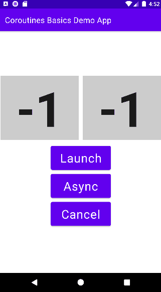

# Simple Kotlin Coroutines App Demo (Jetpack Compose)

## Requirements
- Android Studio Bumblebee or later

## Tech Stack
- Jetpack Compose
- Kotlin Coroutines

## Articles
* [Part 1 - Kotlin Coroutines Basics - Simple Android App Demo](https://vtsen.hashnode.dev/kotlin-coroutines-basics-simple-android-app-demo)    
* [Part 2 - kotlinx.coroutines.delay() vs Thread.sleep()](https://vtsen.hashnode.dev/kotlinxcoroutinesdelay-vs-threadsleep)   
* [Part 3 - GlobalScope vs viewModelScope vs lifecycleScope vs rememberCoroutineScope](https://vtsen.hashnode.dev/globalscope-vs-viewmodelscope-vs-lifecyclescope-vs-remembercoroutinescope)    
* [Part 4 - launchWhenCreated() vs launchWhenStarted() vs launchWhenResumed() vs repeatOnLifeCycle()](https://vtsen.hashnode.dev/launchwhencreated-vs-launchwhenstarted-vs-launchwhenresumed-vs-repeatonlifecycle)
